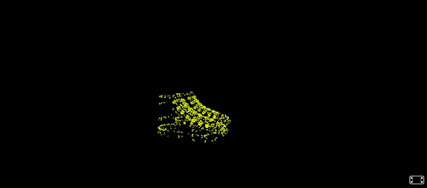

# A-Frame Component: GLTF based Point Cloud Transitions


### **Description / Rationale**
This is an A-Frame component, which demonstrates GLTF based point cloud transitions. It was developed based on <a href="https://medium.com/@mahmed07041/3d-models-transitions-and-mouse-hovering-effects-threejs-664280bd8274">3D Models Transitions and Mouse Hovering Effects — ThreeJS</a> article on Medium.com and Austin Mayer's <a href="https://twitter.com/amayer_/status/1098662776929693706">portfolio project</a>.

### **Instructions**
In order to use the component attach "gltf-transitions" to an entity with "gltf-model" component. The component has the following attributes: 
* <b>pointSize: { type: "float", default: 0.2 }</b> - Size of the point cloud points.
* <b>pointColor: { type: "color", default: "#ffffff" }</b> - Color of the point cloud points.
* <b>pointOpacity: { type: "float", default: 1.0 }</b> - Opacity of the point cloud points.
* <b>pointMovement: { type: "string", default: "none" }</b> - If enabled point cloud points move randomly in place. Has the following attributes: "none", "slow", "faster" and "fastest". 
* <b>manualAnimation: { type: "boolean", default: false }</b> - If disabled it will be possible to move point cloud points using mouse scroller. If enabled, it will play point cloud points animation automatically. 
* <b>pauseTime: { type: "float", default: 5 }</b> - the time each point cloud will remain visible before it transitions to another one. 

The code below shows the sample implementation of the component:
```
<!DOCTYPE html>
<html lang="en">
<head>
  <meta charset="UTF-8" />
  <title>A-Frame Component: GLTF Based PointCloud Transitions</title>
  <script src="https://aframe.io/releases/1.4.0/aframe.min.js"></script>
  <script src="js/gltf-transitions-component.js"></script>
</head>
<body>
  <a-scene>
    <a-entity visible="false" opacity="0" gltf-transitions="pointSize: 0.3; pointColor: #ffffff; pointOpacity: 0.5; pointMovement: slow; manualAnimation: false; pauseTime: 3"
      animation__rotate="property: rotation; dur: 30000; from: 0 0 0; to: 0 360 0; loop: true" id="origin"
      position="0 0 0" rotation="0 0 0" gltf-model="models/shoes.glb" scale="0.1 0.1 0.1"></a-entity>
    <a-entity visible="false" class="target" material="transparent: true; opacity: 0.1;"
      animation__rotate="property: rotation; dur: 30000; from: 0 0 0; to: 0 360 0; loop: true" gltf-model="models/horse.glb"
      scale="0.2 0.2 0.2"></a-entity>
      <a-entity visible="false" class="target" material="transparent: true; opacity: 0.1;"
      animation__rotate="property: rotation; dur: 30000; from: 0 0 0; to: 0 360 0; loop: true" gltf-model="models/stork.glb"
      scale="0.4 0.4 0.4"></a-entity>
      <a-entity visible="false" class="target" material="transparent: true; opacity: 0.1;"
      animation__rotate="property: rotation; dur: 30000; from: 0 0 0; to: 0 360 0; loop: true" gltf-model="models/house.glb"
      scale="1 1 1"></a-entity>
    <a-camera position="-20 20 30"></a-camera>
    <a-sky color="#000000"></a-sky>
  </a-scene>
</body>
</html>
```
<b>Please note:</b> 
* Gltf entity is not visible by default. If you want to see how 3D model and point cloud is located in 3d space, make it visible.
* Make sure that there is only one gltf entity with id="origin" and at least one gltf entity with id="target".   
* It is possible to change point cloud positions and rotations. If you decide to do so, please do make sure to make positions and rotatons the same for all gltf entities or just apply to the entity with id='origin'.   
* It is possible, however, to apply different scales for different GLTF entities.
* Make sure to apply "gltf-transitions" component only to gltf entity with id="origin". 


### **Recommendations**
Not all GLTF models will work equally well. It is important to prepare models beforehand. Make sure to do the following:
* Number of faces of each GLTF file should be close to each other. This is required because generated point cloud points of one GLTF will get transitioned to another one. And if there are less points in the origin GLTF model, then target GLTF model's point cloud will not show completely.
* To make number of faces almost similar, use Blender's functionality for decimating geometry (when there is a need to reduce number of faces) or subdivide (to increase number of faces).
* Make sure, if possible, to combine all meshes into single mesh. This will help in generating the point cloud.
* The more faces are there in a GLTF model, the better it looks visually. However, the more faces also mean slower running experiences.

### **Tech Stack**
The project is powered by AFrame and Three.js. The models used in the example were taken from Poly Pizza (<a href="https://poly.pizza/m/bHyQe5jzdiQ">House</a>, <a href="https://poly.pizza/m/2cAXk_gG3Eh">shoes</a>) and Three.js library.

### **Demo**
See demo of the component here: [Demo](https://pointcloud-transitions.glitch.me/)
